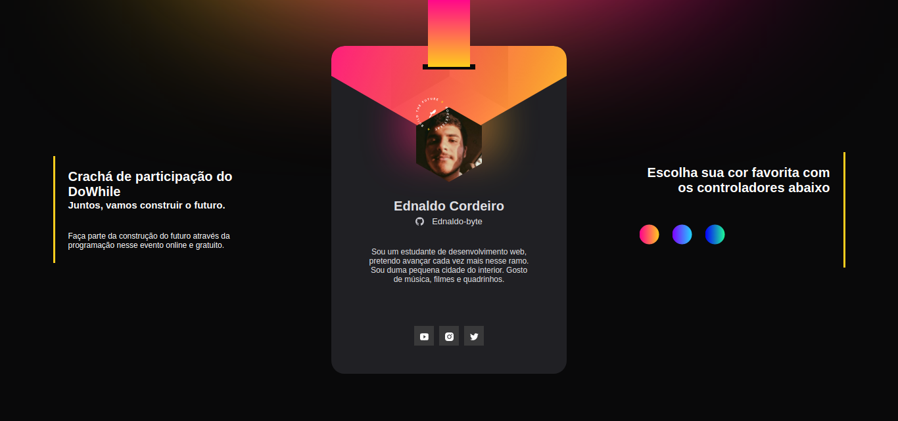

# DoWhile Event Badge

  ## 🖥 Project
  Project developed for web development learning purposes.
  Virtual badge created during the NLW Heat, on the Origin track.

  ## 👨‍💻 Technologies
  The technologies used in this project were:
  - [HTML](https://developer.mozilla.org/en-US/docs/Web/HTML)
  - [CSS](https://developer.mozilla.org/en-US/docs/Web/CSS)
  - [JS](https://developer.mozilla.org/en-US/docs/Web/JavaScript)
  - 
  <div align="center">
      
  </div>

  ## 🖇 Run the project

  To access just use the Github Pages link:
  <br>
  https://ednaldo-byte.github.io/cracha-NLW/
  <br>
  or
  <br>
  clone the repository to your machine
  ```
  git clone https://github.com/Ednaldo-byte/cracha-NLW.git
  ```
  ##  📃 License
  This project has an MIT license. For more details see the file [LICENSE](LICENSE.md)


  ## 📌 Comments
  Different versions of the website were applied: for desktop, tablet and mobile
